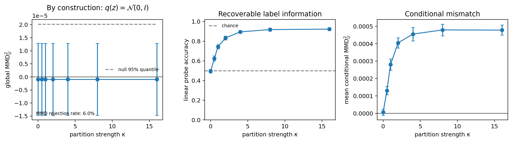

# Báo cáo synthetic exact-marginal experiment

**Trạng thái:** Hoàn tất paper-scale run  
**Ngày hoàn tất:** 2026-08-12  
**Protocol:** `stage0-1.2.0`  
**Thiết bị:** CPU  
**Replications:** 50  
**Result SHA-256:** `88bb2b6e13dc656b3e2463de891b2b9a000987916ba40464e1a9c3517e1d1004`

## 1. Kết luận ngắn

Kết quả hỗ trợ trực tiếp luận điểm lý thuyết trung tâm của paper:

> **Exact global marginal matching does not certify that a latent is
> independent of the label.**

Trong construction này, `z` được sinh từ `N(0,I)` trước khi gán label. Vì vậy
`q(z)=N(0,I)` đúng chính xác ở population level với mọi `kappa`. Tuy nhiên, khi
label assignment trở nên phụ thuộc mạnh hơn vào region của latent space:

- linear probe tăng từ `49.58%` tại `kappa=0` lên `91.82%` tại `kappa=8` và
  `92.30%` tại `kappa=16`;
- HSIC reject independence trong 100% replications tại mọi `kappa>0`;
- conditional MMD tăng mạnh theo `kappa`;
- global MMD vẫn không đổi theo `kappa`, với rejection frequency `3/50=6%`,
  phù hợp nominal level 5%.

Experiment vì vậy biến Proposition 1 từ một counterexample lý thuyết thành
một figure thực nghiệm dễ quan sát. Nó đồng thời kiểm tra rằng audit pipeline
không tạo systematic global-MMD rejection khi exact marginal null thực sự
đúng.

Strict frozen composite gate có `passes_all=false` do `kappa=4` đạt `89.51%`,
thiếu `0.49` percentage points so với criterion `>90%` tại **từng** level
`{4,8,16}`. Kết quả này phải được báo. Nó không phủ định central claim vì target
existential “probe vượt 90% tại `kappa` lớn” vẫn đạt tại `kappa=8` và `16`.

## 2. Vai trò trong paper

Paper phân biệt hai phát biểu:

1. aggregate marginal matching:

   \[
   q(z_s)=p(z_s);
   \]

2. conditional independence cần cho factorized sampling:

   \[
   q(z_s\mid y)=p(z_s)
   \quad\Longleftrightarrow\quad
   I(z_s;y)=0
   \quad\text{under the matched marginal contract.}
   \]

Global MMD chỉ audit phát biểu thứ nhất. Nó không phải certificate cho phát
biểu thứ hai. Checkpoint thật chỉ cho phép nói global discrepancy nhỏ; nó không
cho phép khẳng định exact equality. Synthetic experiment cung cấp phần còn
thiếu: một setting nơi exact equality được đảm bảo theo data-generating
process, trong khi conditional leakage có thể được điều chỉnh đến mức probe
trên 90%.

Evidence chain sau experiment này là:

```text
analytic exact-marginal construction
    -> correctly calibrated empirical global MMD
    -> increasing conditional dependence
    -> >90% recoverable label information
```

Đây là evidence cho logical insufficiency của marginal matching, không phải
bằng chứng mọi trained representation model đều leak. Cross-model experiment
vẫn cần thiết để kiểm tra empirical occurrence qua nhiều architectures.

## 3. Data-generating process

Paper run dùng binary construction:

\[
z\sim\mathcal N(0,I_{128}),
\qquad
p(y=1\mid z)=\sigma(2\kappa z_1).
\]

Implementation tương đương dùng logits:

\[
[-\kappa z_1,\;\kappa z_1].
\]

Quy trình sinh dữ liệu là:

1. sample `z` từ standard Gaussian;
2. tính label probability từ coordinate `z_1`;
3. sample `y` có điều kiện trên `z`.

Do `z` được sample trước và không bị accept/reject hoặc transform theo label,
marginal distribution của `z` không phụ thuộc `kappa`:

\[
q_\kappa(z)=\mathcal N(0,I_{128})
\qquad\forall\kappa.
\]

Khi `kappa=0`, label độc lập với `z` và probe ở chance. Khi `kappa` tăng,
assignment tiến tới partition theo dấu của `z_1`; linear probe vì thế có thể
tiến gần perfect accuracy dù Gaussian marginal không đổi.

Điểm quan trọng: exact marginal equality đến từ construction, không được suy
ra từ việc MMD không reject.

## 4. Paper-scale protocol

| Thành phần | Giá trị |
|---|---:|
| Latent dimension | 128 |
| Classes | 2 |
| Samples mỗi replication | 2,048 |
| Replications | 50 |
| `kappa` | `0, 0.5, 1, 2, 4, 8, 16` |
| Base seed | 2027 |
| Global-MMD permutations | 499 |
| HSIC permutations | 499 |
| Probe epochs tối đa | 300 |
| Probe split | stratified 60/20/20 |
| Global reference | independent `N(0,I)` sample |
| MMD estimator | unbiased multiscale MMD squared U-statistic |

Trong mỗi replication, global MMD được tính đúng một lần trên Gaussian sample
và independent Gaussian reference. Cùng statistic sau đó được gắn với mọi
`kappa`. Vì vậy, mọi biến thiên theo `kappa` trên figure chỉ đến từ label
mechanism, không phải do latent marginal được sample lại.

HSIC dùng plus-one permutation calibration. Với 499 permutations, p-value nhỏ
nhất là `1/500=0.002`.

## 5. Frozen acceptance contract

Acceptance criteria được ghi ra artifact trước khi paper result được tổng hợp:

1. đủ 50 replications;
2. mean probe accuracy lớn hơn 90% tại từng `kappa in {4,8,16}`;
3. Spearman trend của HSIC theo `kappa` ít nhất 0.70;
4. Spearman trend của conditional MMD theo `kappa` ít nhất 0.70;
5. high-kappa HSIC mean lớn hơn null-kappa mean;
6. high-kappa conditional-MMD mean lớn hơn null-kappa mean;
7. global MMD giống nhau qua `kappa` trong từng replication, tolerance
   `1e-12`;
8. global-MMD rejection count nằm trong `[0,6]`, central 95% prediction
   interval của `Binomial(n=50,p=0.05)`.

Không thay threshold hoặc chọn lại `kappa` sau khi xem paper result.

## 6. Kết quả đầy đủ

| `kappa` | Probe mean ± std | `I_LB` mean (nats) | Global MMD2 mean | Global reject | HSIC mean | HSIC reject | Conditional MMD2 mean |
|---:|---:|---:|---:|---:|---:|---:|---:|
| 0 | 49.58 ± 1.86% | -0.050 | -0.00000095 | 6% | 0.000176 | 2% | 0.000006 |
| 0.5 | 62.48 ± 2.58% | 0.031 | -0.00000095 | 6% | 0.000239 | 100% | 0.000130 |
| 1 | 74.49 ± 2.09% | 0.171 | -0.00000095 | 6% | 0.000314 | 100% | 0.000280 |
| 2 | 83.28 ± 2.07% | 0.334 | -0.00000095 | 6% | 0.000377 | 100% | 0.000405 |
| 4 | 89.51 ± 1.45% | 0.437 | -0.00000095 | 6% | 0.000404 | 100% | 0.000455 |
| 8 | 91.82 ± 1.63% | 0.471 | -0.00000095 | 6% | 0.000413 | 100% | 0.000479 |
| 16 | 92.30 ± 1.51% | 0.475 | -0.00000095 | 6% | 0.000415 | 100% | 0.000478 |



### 6.1. Global marginal calibration

Mean global MMD2 là khoảng `-9.47e-7`. Unbiased finite-sample MMD có thể âm;
không clip về zero vì clipping sẽ làm sai null distribution.

Ba trong 50 independent replications reject ở alpha 0.05:

\[
\widehat r_{MMD}=3/50=0.06.
\]

Count `3` nằm trong frozen interval `[0,6]`. Vì cùng global statistic được dùng
cho mọi `kappa`, rejection rate 6% lặp lại trên mỗi row của summary nhưng chỉ
đại diện cho 50 tests, không phải 350 independent global-MMD tests.

Maximum global-MMD range qua `kappa` trong một replication bằng `0.0`. Đây là
integration check rằng runner không vô tình thay latent sample khi đổi label
mechanism.

### 6.2. Recoverable label information

Probe curve tăng gần đơn điệu:

```text
49.58% -> 62.48% -> 74.49% -> 83.28% -> 89.51% -> 91.82% -> 92.30%
```

Tại `kappa=0`, mean accuracy gần binary chance 50%. Tại `kappa=8` và `16`,
accuracy vượt target 90% qua 50 replications. Điều này trực quan hóa fact rằng
unchanged Gaussian marginal có thể mang label information mạnh thông qua
class-conditional partition.

Classifier-based `I_LB` âm nhẹ tại `kappa=0` không có nghĩa mutual information
âm. Nó chỉ cho thấy finite-sample classifier không cung cấp positive lower
bound dưới null. `I_LB` sau đó tăng lên khoảng `0.48 nats` ở `kappa=16`.

### 6.3. Conditional dependence

HSIC rejection rate là 2% tại `kappa=0`, phù hợp null behavior, và 100% tại
mọi `kappa>0`. Mean HSIC tăng với Spearman correlation `1.0`.

Mean conditional MMD2 tăng từ `6.16e-6` tại null lên khoảng `4.78e-4` ở
`kappa=16`; Spearman trend là `0.964`. Plateau nhỏ giữa `kappa=8` và `16` là
phù hợp với label rule đang tiến tới hard sign partition.

Hai diagnostics bổ sung cho probe:

- probe đo information có thể khai thác bởi một fixed classifier;
- HSIC kiểm tra dependence;
- conditional MMD đo mismatch của `q(z|y)` với global Gaussian prior.

Sự đồng thuận của ba views mạnh hơn việc chỉ báo một probe accuracy.

## 7. Phân tích strict gate không pass

| Frozen check | Kết quả |
|---|---|
| 50 replications | Pass |
| Probe >90% tại từng `kappa={4,8,16}` | **Fail** |
| HSIC positive trend | Pass |
| Conditional-MMD positive trend | Pass |
| High-kappa HSIC > null | Pass |
| High-kappa conditional MMD > null | Pass |
| Global MMD invariant qua `kappa` | Pass |
| MMD rejection count Binomial-compatible | Pass |

Failure đến duy nhất từ `kappa=4`:

```text
required: >90.00%
observed:  89.51%
gap:        0.49 percentage points
```

Không nên đổi `>` thành `>=`, bỏ `kappa=4`, hoặc chọn một replication thuận
lợi sau khi thấy result. Correct reporting là:

- strict eight-part composite gate không pass toàn bộ;
- exact marginal/calibration gates đều pass;
- trend/dependence gates đều pass;
- original pedagogical target `ProbeACC>90%` ở large `kappa` đạt tại 8 và 16.

Central scientific claim là một existence claim: exact marginal equality có
thể cùng tồn tại với label leakage mạnh. Nó không yêu cầu mọi arbitrarily
chosen intermediate `kappa` phải vượt 90%. Vì vậy, gate failure thu hẹp cách
viết result nhưng không làm mất support cho Proposition 1.

## 8. Claim được phép dùng

### 8.1. Main-text claim đề xuất

> In an exact construction with `q(z)=N(0,I)` for every partition strength,
> the empirical global-MMD test remains calibrated at 6% rejection over 50
> replications, while linear label-probe accuracy exceeds 90% and both HSIC
> and conditional MMD reveal strong conditional structure.

Phiên bản ngắn cho abstract/introduction:

> Exact marginal equality can coexist with more than 90% recoverable label
> information.

### 8.2. Figure caption đề xuất

> **Exact marginal matching does not certify label independence.** We sample
> `z~N(0,I)` before assigning binary labels according to a smooth latent-space
> partition. Thus the marginal is exactly Gaussian for all `kappa`. Across 50
> replications, global MMD rejects at 6%, consistent with its nominal 5% level,
> while probe accuracy rises above 90% and conditional discrepancy increases.
> Error bars show one standard deviation across replications.

### 8.3. Claim không được dùng

Không được viết rằng:

- failure to reject MMD chứng minh empirical distributions bằng nhau;
- mọi real checkpoint đạt exact marginal matching;
- every `kappa>=4` đạt probe trên 90%;
- mọi factorized model đều leak;
- MMD là một estimator không hợp lệ;
- probe accuracy là exact mutual information.

Thông điệp đúng là MMD làm đúng nhiệm vụ marginal test của nó, nhưng marginal
test không thể certify conditional independence.

## 9. Reproducibility và execution log

Command:

```bash
systemd-run --user \
  --unit=fcswae-synthetic-paper \
  --collect --same-dir \
  --property=Restart=on-failure \
  --property=RestartSec=30s \
  .venv/bin/python scripts/run_synthetic_exact_marginal.py \
  --paper \
  --output-dir runs_diag/synthetic_exact_marginal_paper
```

Execution:

- start: 2026-08-12 11:14:09 `Asia/Ho_Chi_Minh`;
- finish: 2026-08-12 11:15:51;
- wall time: khoảng 1 phút 42 giây;
- workers: 8;
- Torch threads mỗi worker: 8;
- HSIC permutation batch size: 64;
- systemd result: success;
- exit status: 0;
- restarts: 0.

Runner ghi nguyên tử `partial_results.json` sau mỗi replication. Final partial
artifact chứa đủ replications `0..49` và 350 records. Chạy lại đúng config sẽ
verify checksum rồi reuse result; config khác bị từ chối để tránh pool hai
protocols.

## 10. Artifact inventory

| Artifact | Vai trò | SHA-256 |
|---|---|---|
| [results.json](../runs_diag/synthetic_exact_marginal_paper/results.json) | Manifest, 350 raw records và summary | `88bb2b6e...1d1004` |
| [exact_marginal_vs_leakage.png](../runs_diag/synthetic_exact_marginal_paper/exact_marginal_vs_leakage.png) | Main-paper candidate figure | `220cc5e7...8d327e` |
| [acceptance_criteria.json](../runs_diag/synthetic_exact_marginal_paper/acceptance_criteria.json) | Frozen pre-result contract | `e327d0f7...ab0a45` |
| [acceptance_result.json](../runs_diag/synthetic_exact_marginal_paper/acceptance_result.json) | Per-check result và strict aggregate decision | `3a52eeb8...2c331` |
| [partial_results.json](../runs_diag/synthetic_exact_marginal_paper/partial_results.json) | Atomic resume checkpoint, 50 replications | `6f1f4b32...5af042` |

Mỗi final JSON có `.sha256` sidecar. Tất cả sidecars đã được kiểm tra thành
công; không còn temporary file sau completion.

Manifest ghi:

- source commit: `8205de50bfcd92c5f74cef4eabecefa52e4e4aad`;
- worktree state: dirty;
- Python: 3.10.12;
- PyTorch: 2.6.0+cu124;
- available CPUs: 96;
- device: CPU.

Dirty-worktree flag phải được giữ trong reproducibility disclosure. Paper
package cuối nên snapshot source diff hoặc tái tạo artifact từ một clean
revision trước camera-ready nếu cần exact repository-level reproduction.

## 11. Verification status

- Paper config và protocol manifest: verified.
- 50 completed replications: verified.
- 350 raw records: verified.
- Result, criteria và acceptance checksums: verified.
- No atomic temporary files: verified.
- Figure rendering: visually inspected.
- Targeted synthetic/audit tests: 18 pass.
- Full repository tests tại thời điểm experiment: 22 pass, 2 legacy ablation
  failures do old forward-output unpacking; các lỗi này không nằm trên
  synthetic/audit code path.

## 12. Kết luận đối với roadmap

Synthetic exact-marginal experiment đã hoàn thành mục tiêu khoa học chính:

```text
exact q(z)=N(0,I)
    + correctly calibrated global MMD
    + increasing conditional dependence
    + >90% label probe at high kappa
```

Nó là bridge sạch giữa Proposition 1 và diagnostics dùng trên checkpoint thật.
Experiment này có thể đưa vào main paper ngay với disclosure về strict
`kappa=4` gate. Bước tiếp theo để mở rộng external validity không phải chạy
thêm synthetic seeds hoặc chọn lại `kappa`, mà là cross-model audit trên các
native factorized families.
