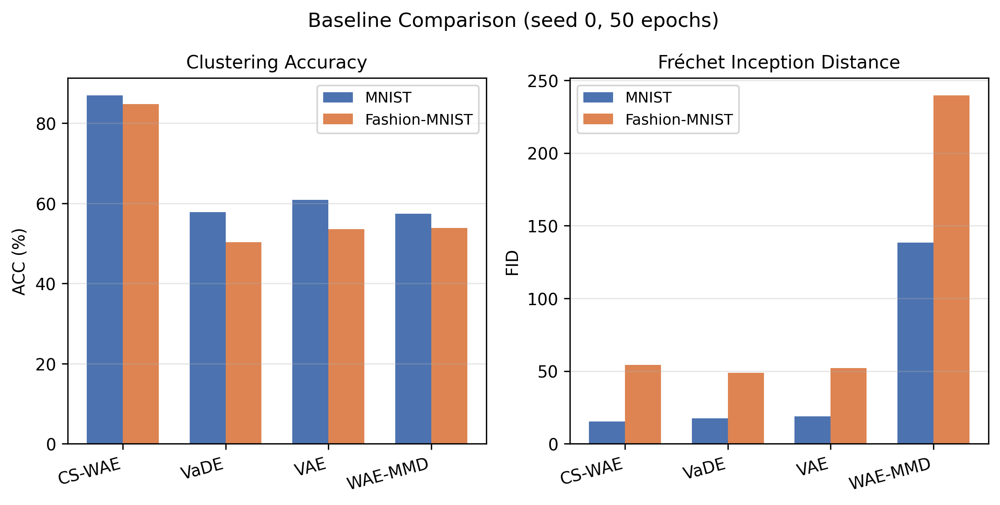
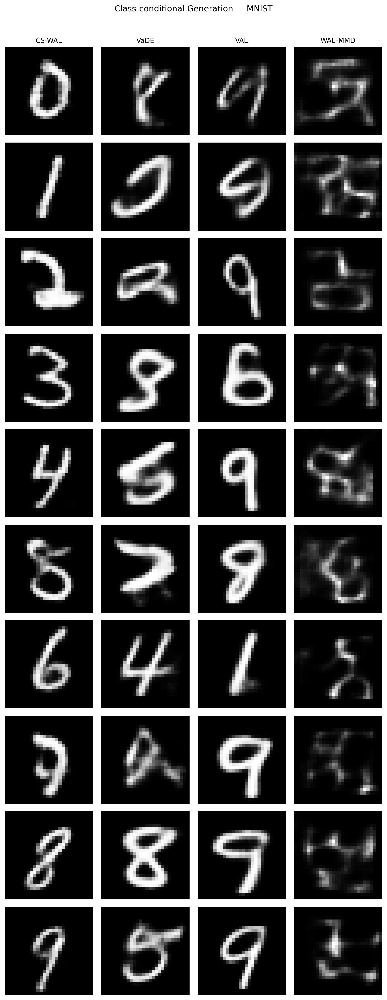
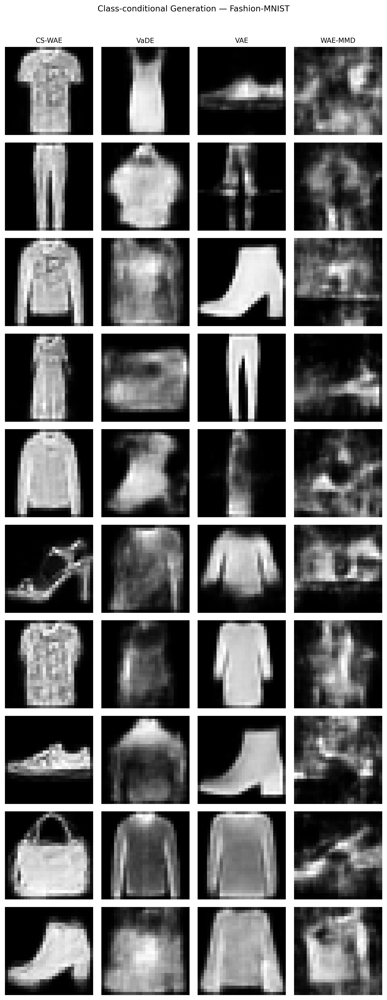
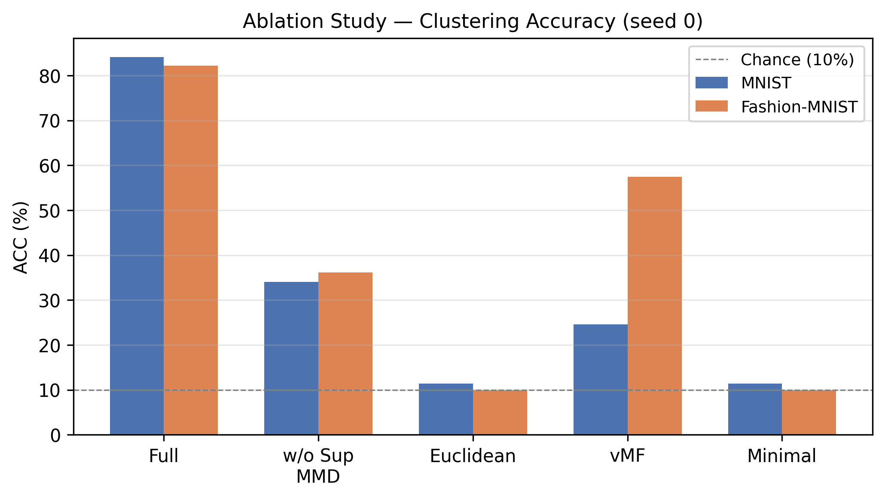
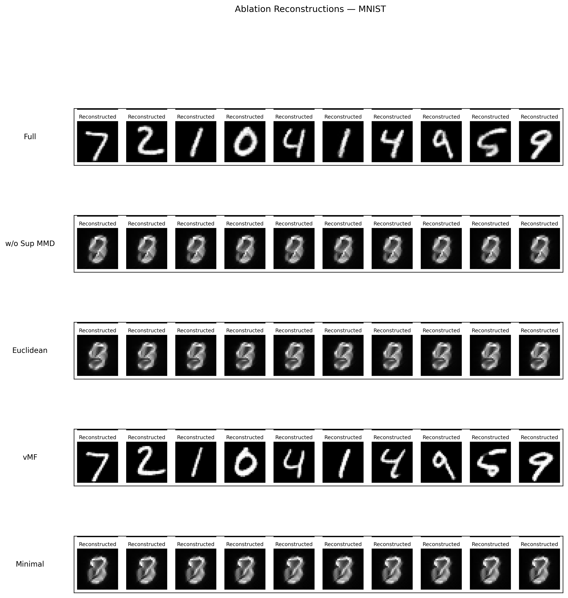
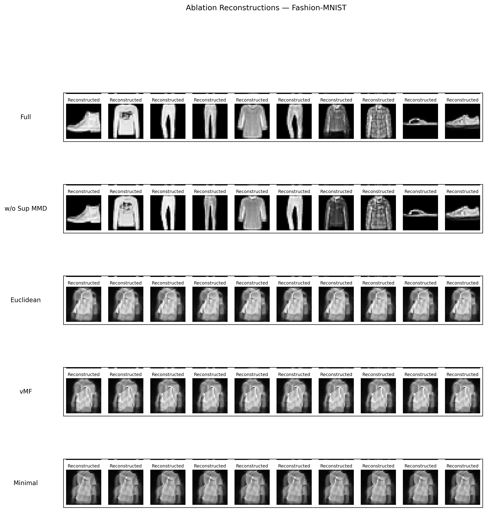
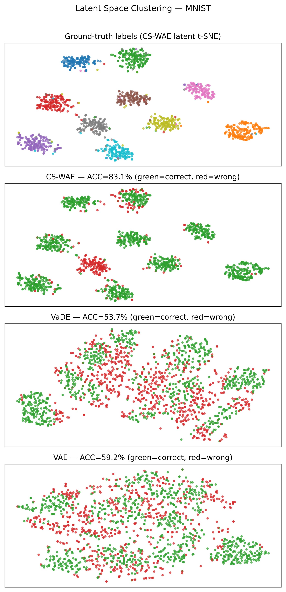
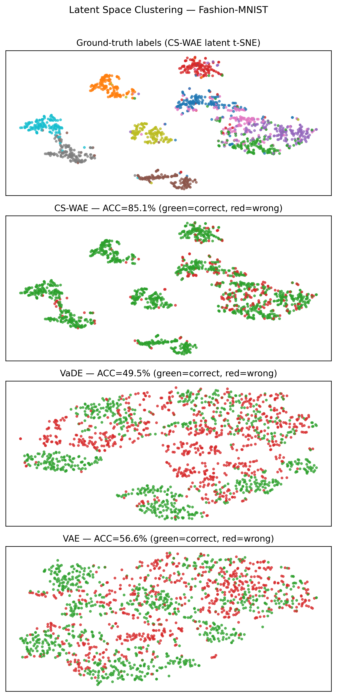
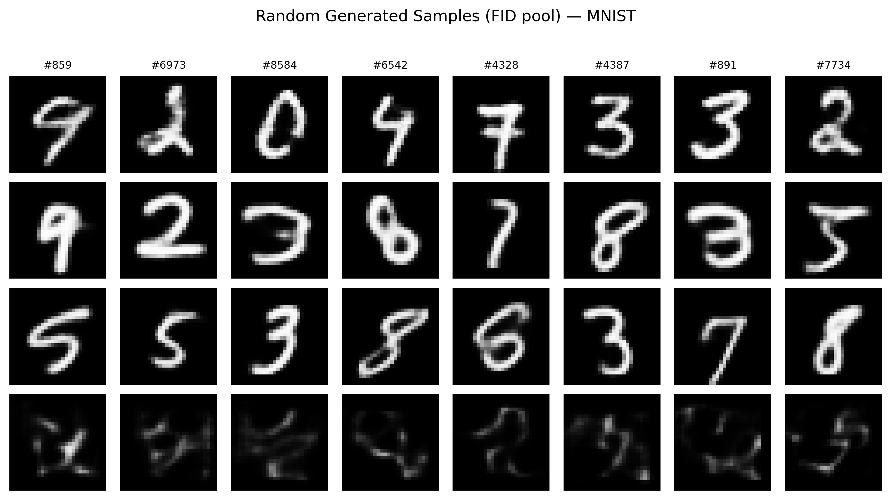
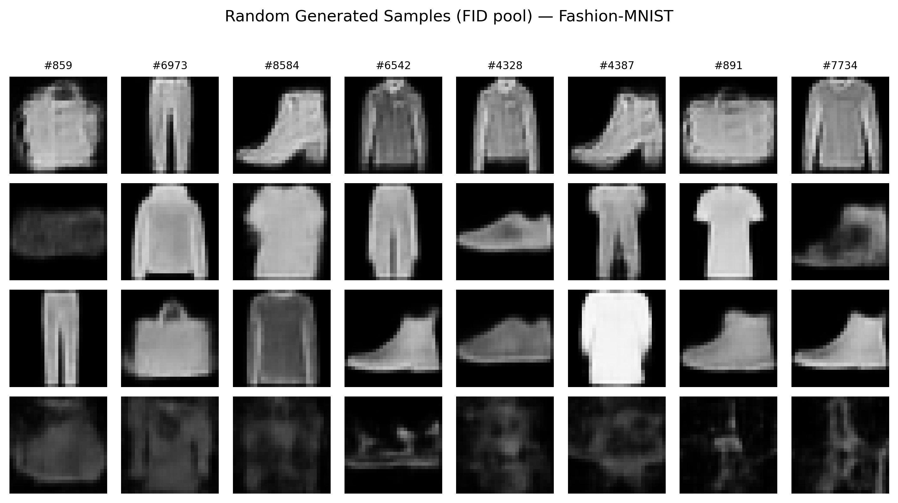

# CS-WAE: Class-Structured Spherical Cauchy Wasserstein Auto-Encoders for Label-Guided Generative Clustering

Anonymous Authors  
Anonymous Institution  
`anonymous@example.com`

## Abstract

Learning a latent representation that is simultaneously useful for clustering, reconstruction, and sampling remains a central challenge in auto-encoding generative modeling. Variational auto-encoders and Wasserstein auto-encoders provide powerful generative frameworks, but standard Euclidean Gaussian priors do not by themselves induce class-separated latent geometry. We introduce **CS-WAE**, a class-structured Spherical Cauchy Wasserstein auto-encoder for label-guided generative clustering. CS-WAE maps inputs to Spherical Cauchy latent distributions on the hypersphere, learns class-indexed prior centers, and aligns encoded samples to these priors using a dual maximum mean discrepancy objective. The first MMD term is supervised and class-conditional, encouraging samples from each class to match the corresponding class prior; the second is unsupervised and aggregated, preserving global sampleability from the prior mixture. The model combines this distributional alignment with a reconstruction objective mixing binary cross-entropy and LPIPS. On MNIST, CS-WAE reaches **92.9 +/- 3.9%** clustering accuracy over three seeds, and on Fashion-MNIST it reaches **79.0 +/- 8.0%**. Under a 50-epoch seed-0 baseline protocol, CS-WAE improves clustering accuracy by roughly **26-34 percentage points** over VAE, VaDE, and WAE-MMD. Ablations show that removing supervised MMD, replacing the hypersphere with a Euclidean latent space, or replacing the Spherical Cauchy prior with a von Mises-Fisher prior substantially degrades clustering or sample quality. These results support a simple thesis: for label-guided generative clustering, the latent geometry, prior family, and distribution-matching objective must be designed jointly.

## 1. Introduction

Auto-encoding generative models are compelling because they promise a single representation that can reconstruct inputs, generate new samples, and expose meaningful semantic structure. In practice, these goals often pull the latent space in different directions. A model can reconstruct accurately while learning a latent distribution that is difficult to sample from. It can generate plausible samples while failing to organize the latent space into clusters useful for downstream analysis. It can also achieve high clustering accuracy by using labels or discriminative losses, but then lose the generative interpretation of the latent prior.

This tension appears clearly in two influential families of models. Variational auto-encoders (VAEs) optimize a likelihood-based lower bound with a prior regularizer, usually a standard Gaussian prior [Kingma and Welling, 2013]. Wasserstein auto-encoders (WAEs) instead match the aggregated posterior to a prior, often using maximum mean discrepancy (MMD) or adversarial matching [Tolstikhin et al., 2017]. Both are principled, but neither automatically yields class-separated latent geometry. Euclidean Gaussian priors are convenient, yet their radial degrees of freedom and unstructured global geometry do not naturally match the goal of class-aware clustering.

Deep generative clustering models, such as VaDE [Jiang et al., 2016], introduce mixture structure into the latent prior. This is an important step: a single Gaussian is replaced by a mixture whose components can correspond to clusters. However, Gaussian mixture priors remain Euclidean and unbounded. For visual categories whose identities are often better represented by direction than by radius, hyperspherical latent spaces are attractive. Hyperspherical VAEs [Davidson et al., 2018] showed that distributions on the unit sphere can be useful alternatives to Gaussian latents, while recent Spherical Cauchy VAEs [Sablica and Hornik, 2025] suggest that heavy-tailed spherical distributions with efficient Mobius-transform reparameterization can avoid some practical difficulties of von Mises-Fisher variables.

This paper studies the following question:

> Can a heavy-tailed spherical latent family be combined with WAE-style distribution matching to learn a latent space that is class-structured, samplable, and useful for simple clustering evaluation?

We answer this question with **CS-WAE**, a class-structured Spherical Cauchy Wasserstein auto-encoder. The model maps each input image to the parameters of a Spherical Cauchy distribution on the hypersphere. Its prior consists of learnable class centers on the same hypersphere. During training, encoded samples are aligned with class-specific priors using a supervised MMD term, while the aggregated posterior is simultaneously aligned to the mixture over class priors using an unsupervised MMD term. The supervised term gives the latent space class structure; the unsupervised term preserves the WAE-style prior matching needed for generation.

### Scope and claim

CS-WAE is **not** a fully unsupervised clustering method in the strict sense. The training objective uses labels in the supervised MMD term. The correct framing is therefore **label-guided generative clustering** or **class-structured generative representation learning**. Evaluation uses K-means followed by Hungarian matching, but labels are used during training to align class-conditional latent distributions. This distinction is important: it prevents overstating the method and makes the scientific claim sharper.

The central claim is not that CS-WAE is a universal generative model, nor that it dominates all sample-quality metrics. Rather, CS-WAE shows that a carefully designed spherical class prior plus distribution-level alignment can produce latent spaces that are far more useful for clustering than standard VAE, WAE-MMD, and VaDE baselines, while retaining competitive sample quality.

### Contributions

1. We introduce a WAE-style auto-encoder with Spherical Cauchy latent variables and learnable class priors on the hypersphere.
2. We propose a dual MMD objective combining supervised class-conditional matching with unsupervised aggregated prior matching.
3. We provide a controlled experimental study on MNIST and Fashion-MNIST, including multi-seed CS-WAE runs, baseline comparisons, ablations, and qualitative visualizations.
4. We show empirically that supervised MMD, spherical geometry, and the Spherical Cauchy prior are each important to the final behavior.
5. We explicitly analyze failure modes and limitations, including seed variance, single-seed baselines, and the fact that the current method is label-guided rather than fully unsupervised.

## 2. Related Work

### Variational auto-encoders

VAEs [Kingma and Welling, 2013] combine an encoder, a decoder, and a latent prior through the evidence lower bound. The standard Gaussian prior makes reparameterization simple and scalable, but can also encourage latent spaces that are overly smooth, weakly clustered, or poorly aligned with semantic classes. Many variants improve posterior expressiveness or change the prior, but the default Euclidean geometry remains a common assumption.

### Wasserstein auto-encoders

WAEs [Tolstikhin et al., 2017] replace the per-sample KL regularizer of VAEs with a divergence between the aggregated posterior and the prior. This makes WAE objectives attractive for learning latent distributions that are samplable as a whole. MMD-based WAEs are especially relevant to CS-WAE because they perform explicit distribution matching with kernels. However, standard WAE-MMD does not impose class structure. As our experiments show, WAE-MMD can reconstruct well yet sample poorly and cluster weakly.

### Deep generative clustering

Deep Embedded Clustering (DEC) [Xie et al., 2015] learns representations optimized for clustering, while VaDE [Jiang et al., 2016] integrates a Gaussian mixture prior into a VAE. VaDE is a key baseline because it is both generative and cluster-oriented. CS-WAE differs in two ways. First, it uses labels during training to align class-conditional distributions, so the problem setting is label-guided. Second, it replaces Euclidean mixture geometry with class centers on a hypersphere and heavy-tailed Spherical Cauchy priors.

### Hyperspherical latent variables

Hyperspherical VAEs [Davidson et al., 2018] motivate latent variables on the unit sphere, commonly using von Mises-Fisher distributions. Spherical latent spaces remove radial degrees of freedom and encourage directional representations. Spherical sliced-Wasserstein methods [Bonet et al., 2022] further show that optimal-transport-inspired objectives can be adapted to spherical domains. Recent Spherical Cauchy VAEs [Sablica and Hornik, 2025] propose efficient Spherical Cauchy variables with Mobius-transform reparameterization. CS-WAE builds on this direction but applies Spherical Cauchy variables to a WAE-style class-structured objective.

### Evaluation of generative representations

Generative representation learning should not be evaluated by reconstruction alone. We report clustering accuracy, normalized mutual information (NMI), adjusted Rand index (ARI), FID [Heusel et al., 2017], SSIM, PSNR, and LPIPS [Zhang et al., 2018]. The multi-metric evaluation is necessary because different objectives can conflict. In our results, WAE-MMD obtains strong reconstruction SSIM but very poor FID, illustrating that pixel-level reconstruction does not guarantee useful prior sampling.

## 3. Method

### 3.1 Problem setting

Let:

$$
\mathcal{D} = \{(x_i, y_i)\}_{i=1}^{n},
$$

where each image \(x_i \in [0,1]^{1 \times 28 \times 28}\) and each label \(y_i \in \{1,\dots,K\}\). In our experiments, \(K=10\) and the latent dimension is \(d=32\). The goal is to learn an encoder-decoder model whose latent representation:

1. reconstructs inputs,
2. forms class-structured clusters,
3. remains samplable from a known prior.

Unlike a purely discriminative classifier, the model must define a generative path from prior samples to images. Unlike a fully unsupervised clustering model, the present version uses labels during training.

### 3.2 Design principles

CS-WAE is built around three principles.

**Principle 1: class structure should live in the prior.**  
If class information is imposed only through an auxiliary classifier, the decoder does not necessarily learn how to sample from class-structured regions. CS-WAE instead learns one prior center per class and aligns encoded class-conditional distributions to those priors.

**Principle 2: matching should be distributional, not pointwise.**  
Pointwise losses can collapse variability. MMD compares distributions, allowing each class to retain intra-class diversity while still matching a class prior.

**Principle 3: directional geometry should be explicit.**  
A hypersphere removes uncontrolled radial degrees of freedom. This encourages class identity to be encoded in direction and makes angular separation between class priors meaningful.

### 3.3 Spherical Cauchy encoder

The encoder maps an image \(x\) to an unnormalized direction and scalar radius parameter:

$$
(\tilde{\mu}_q, s_q) = E_\phi(x).
$$

The direction is normalized:

$$
\mu_q = \frac{\tilde{\mu}_q}{\|\tilde{\mu}_q\|_2},
$$

and the scalar parameter is squashed:

$$
\rho_q = \sigma(s_q)(1-\epsilon).
$$

The model samples a point from the sphere:

$$
\epsilon_s \sim \mathrm{Unif}(\mathbb{S}^{d-1}),
$$

then applies a Mobius Spherical Cauchy reparameterization:

$$
z_q = T_{\mu_q,\rho_q}(\epsilon_s).
$$

The decoder reconstructs:

$$
\hat{x} = D_\theta(z_q).
$$

For clustering evaluation, we use the deterministic direction \(\mu_q\), analogous to using the posterior mean in a VAE. The stochastic sample \(z_q\) is used during training.

### 3.4 Class-structured Spherical Cauchy prior

CS-WAE learns \(K\) prior directions:

$$
M = \{m_1,\dots,m_K\}, \qquad m_c \in \mathbb{S}^{d-1}.
$$

Each class prior is a Spherical Cauchy distribution centered at \(m_c\) with fixed prior radius:

$$
\rho_p = 0.7.
$$

To sample from class \(c\):

$$
\epsilon_s \sim \mathrm{Unif}(\mathbb{S}^{d-1}), \qquad
z_p^{(c)} = T_{m_c,\rho_p}(\epsilon_s).
$$

The prior centers are learnable rather than fixed. This matters because semantic class geometry is not necessarily uniform. In Fashion-MNIST, for example, shirts, coats, and pullovers are visually closer than shoes and bags. A fixed spherical code would impose equal class separation even when visual structure is unequal.

### 3.5 Dual MMD objective

MMD compares two distributions through kernel mean embeddings. Given samples \(A=\{a_i\}_{i=1}^{n}\) and \(B=\{b_j\}_{j=1}^{m}\), the empirical squared MMD is:

$$
\widehat{\mathrm{MMD}}^2(A,B)
=
\frac{1}{n^2}\sum_{i,i'} k(a_i,a_{i'})
+
\frac{1}{m^2}\sum_{j,j'} k(b_j,b_{j'})
-
\frac{2}{nm}\sum_{i,j} k(a_i,b_j).
$$

CS-WAE uses two MMD terms.

#### Supervised class-conditional MMD

For each class \(c\), encoded samples from that class are matched to samples from the corresponding class prior:

$$
\mathcal{L}_{\mathrm{sup}}
=
\frac{1}{K}
\sum_{c=1}^{K}
\mathrm{MMD}
\left(
\{z_q^i : y_i=c\},
\{z_p^{(c),j}\}_{j=1}^{n_c}
\right).
$$

This term is the main source of class separation. It makes each prior center a distributional anchor for one label.

#### Unsupervised aggregated MMD

The full encoded batch is also matched to a random mixture over class priors:

$$
\mathcal{L}_{\mathrm{unsup}}
=
\mathrm{MMD}
\left(
\{z_q^i\}_{i=1}^{b},
\{z_p^{(r_j),j}: r_j \sim \mathrm{Unif}(\{1,\dots,K\})\}_{j=1}^{b}
\right).
$$

This term preserves global WAE-style prior matching. Without it, the class priors may become useful anchors without collectively forming a coherent generative mixture.

### 3.6 Reconstruction and total objective

The reconstruction loss combines BCE and LPIPS:

$$
\mathcal{L}_{\mathrm{rec}}
=
\lambda_{\mathrm{BCE}}\mathrm{BCE}(x,\hat{x})
+
\lambda_{\mathrm{LPIPS}}\mathrm{LPIPS}(x,\hat{x}).
$$

We use:

$$
\lambda_{\mathrm{BCE}} = 0.3, \qquad
\lambda_{\mathrm{LPIPS}} = 0.7.
$$

The total objective is:

$$
\mathcal{L}
=
\mathcal{L}_{\mathrm{rec}}
+
\alpha(t)\mathcal{L}_{\mathrm{sup}}
+
\beta(t)\mathcal{L}_{\mathrm{unsup}}.
$$

The weights are linearly annealed during the first 20 epochs:

$$
\alpha(t): 0 \rightarrow 20, \qquad
\beta(t): 0 \rightarrow 50.
$$

Annealing is important because early strong MMD pressure can disrupt reconstruction learning before the encoder-decoder has learned a useful image manifold.

### 3.7 Training algorithm

```text
Algorithm 1: CS-WAE training step

Input:
  Mini-batch (x, y)
  Encoder E_phi
  Decoder D_theta
  Class prior centers {m_c}_{c=1}^K

1. Encode x:
     (mu_tilde, s_q) = E_phi(x)

2. Normalize direction and compute radius:
     mu_q = mu_tilde / ||mu_tilde||_2
     rho_q = sigmoid(s_q) * (1 - epsilon)

3. Sample spherical noise:
     eps_s ~ Uniform(S^{d-1})

4. Reparameterize:
     z_q = T_{mu_q, rho_q}(eps_s)

5. Decode:
     x_hat = D_theta(z_q)

6. Compute reconstruction loss:
     L_rec = 0.3 * BCE(x, x_hat) + 0.7 * LPIPS(x, x_hat)

7. For each class c:
     sample z_p^(c) from the Spherical Cauchy prior centered at m_c
     accumulate MMD({z_q^i: y_i=c}, z_p^(c))

8. Sample random class indices r_j and prior-mixture samples z_p^(r_j)

9. Compute:
     L = L_rec + alpha(t) * L_sup + beta(t) * L_unsup

10. Update encoder, decoder, and prior centers with Adam.
```

## 4. Experimental Setup

### 4.1 Datasets

We evaluate on MNIST [LeCun et al., 1998] and Fashion-MNIST [Xiao et al., 2017]. Both datasets contain grayscale \(28 \times 28\) images and 10 classes. MNIST is relatively clean and class-separated, while Fashion-MNIST contains visually similar categories and larger intra-class variation.

### 4.2 Baselines

We compare against:

- **VAE**: standard Euclidean latent variational auto-encoder.
- **WAE-MMD**: Euclidean Wasserstein auto-encoder with MMD prior matching.
- **VaDE**: variational deep embedding with a Gaussian mixture prior.
- **CS-WAE**: the proposed class-structured spherical model.

The baseline comparison uses seed 0 and 50 epochs. This is not as strong as a full multi-seed baseline study; it is listed as a limitation and recommended next experiment.

### 4.3 Training protocol

All main experiments use:

| Hyperparameter | Value |
|---|---:|
| Epochs | 50 |
| Batch size | 128 |
| Optimizer | Adam |
| Learning rate | 1e-3 |
| Scheduler | StepLR(step=30, gamma=0.5) |
| Gradient clipping | max norm 1.0 |
| Latent dimension | 32 |
| Classes | 10 |
| Prior radius | 0.7 |
| FID samples | 10,000 generated vs 10,000 real |

### 4.4 Metrics

We report:

- **ACC**: clustering accuracy after K-means and Hungarian matching.
- **NMI**: normalized mutual information.
- **ARI**: adjusted Rand index.
- **FID**: Fréchet Inception Distance between generated and real samples.
- **SSIM / PSNR / LPIPS**: reconstruction quality metrics.

For clustering, CS-WAE uses \(\mu_q\) as the latent representation. VAE and VaDE use encoder means. WAE-MMD uses its encoder output.

## 5. Main Results

### 5.1 Multi-seed CS-WAE performance

| Dataset | ACC up | NMI up | ARI up | FID down |
|---|---:|---:|---:|---:|
| MNIST | **92.9 +/- 3.9** | **89.0 +/- 0.8** | **88.5 +/- 3.2** | **19.4 +/- 5.3** |
| Fashion-MNIST | **79.0 +/- 8.0** | **76.2 +/- 1.4** | **69.0 +/- 6.1** | **50.7 +/- 1.6** |

CS-WAE obtains strong clustering on both datasets. The drop from MNIST to Fashion-MNIST is expected because Fashion-MNIST has more visually confusable categories. The larger standard deviation in Fashion-MNIST ACC indicates higher initialization sensitivity.

### 5.2 Per-seed behavior

| Dataset | Seed | ACC | NMI | ARI | FID | SSIM | LPIPS | PSNR |
|---|---:|---:|---:|---:|---:|---:|---:|---:|
| MNIST | 0 | 87.35 | 88.63 | 84.11 | 26.95 | 0.813 | 0.060 | 16.38 |
| MNIST | 1 | 95.28 | 88.23 | 89.88 | 15.48 | 0.861 | 0.049 | 17.77 |
| MNIST | 2 | **96.10** | **90.08** | **91.62** | **15.82** | **0.878** | **0.044** | **18.36** |
| Fashion-MNIST | 0 | 82.24 | **77.37** | 72.07 | 49.89 | **0.697** | **0.120** | **16.51** |
| Fashion-MNIST | 1 | 68.03 | 74.20 | 60.53 | 52.82 | 0.678 | 0.126 | 16.20 |
| Fashion-MNIST | 2 | **86.67** | 76.91 | **74.50** | **49.26** | 0.689 | 0.121 | 16.36 |

The seed-level results reveal two important patterns. First, ACC is more variable than NMI. This suggests that the latent structure is often meaningful even when exact cluster-label assignment varies. Second, FID can be more stable than ACC, especially on Fashion-MNIST. In other words, the decoder and prior mixture may retain reasonable sample quality even when K-means alignment becomes less stable.

## 6. Baseline Comparison

| Dataset | Method | ACC up | NMI up | ARI up | FID down |
|---|---|---:|---:|---:|---:|
| MNIST | **CS-WAE** | **86.9** | **85.0** | **82.1** | **15.2** |
| MNIST | VAE | 60.9 | 55.3 | 45.6 | 18.8 |
| MNIST | VaDE | 57.8 | 53.4 | 42.4 | 17.4 |
| MNIST | WAE-MMD | 57.5 | 50.6 | 38.7 | 138.3 |
| Fashion-MNIST | **CS-WAE** | **84.8** | **75.2** | **71.9** | 54.2 |
| Fashion-MNIST | VAE | 53.6 | 49.7 | 37.1 | 52.1 |
| Fashion-MNIST | VaDE | 50.3 | 50.7 | 36.3 | **48.7** |
| Fashion-MNIST | WAE-MMD | 53.9 | 57.5 | 41.2 | 239.6 |



CS-WAE substantially improves clustering accuracy on both datasets. On MNIST, the gap over the strongest baseline is approximately 26 points. On Fashion-MNIST, the gap is approximately 31 points. The clustering advantage is therefore not restricted to the easier digit dataset.

The FID results are more nuanced. CS-WAE obtains the best FID on MNIST, but VaDE has the best FID on Fashion-MNIST. This means the correct claim is not that CS-WAE always produces the best samples. The more defensible claim is that CS-WAE produces a much stronger clustering representation while maintaining competitive sample quality.

### Reconstruction-sampling trade-off

| Dataset | Method | SSIM up |
|---|---|---:|
| MNIST | CS-WAE | 0.891 |
| MNIST | VAE | 0.909 |
| MNIST | VaDE | 0.909 |
| MNIST | **WAE-MMD** | **0.942** |
| Fashion-MNIST | CS-WAE | 0.728 |
| Fashion-MNIST | VAE | 0.773 |
| Fashion-MNIST | VaDE | 0.776 |
| Fashion-MNIST | **WAE-MMD** | **0.821** |

WAE-MMD obtains the best SSIM on both datasets but the worst FID by a large margin. This exposes a key failure mode: pixel reconstruction quality does not imply that the learned prior is useful. A model may reconstruct images well from encoded latents while generating poor images from prior samples.

### Qualitative generation





The generation grids show the practical consequence of prior design. WAE-MMD often produces blurry or unstable prior samples. VaDE can generate plausible Fashion-MNIST images but does not produce a latent representation as aligned with the clustering protocol. CS-WAE samples remain tied to class-structured spherical priors.

## 7. Ablation Study

| Dataset | Variant | ACC up | NMI up | FID down |
|---|---|---:|---:|---:|
| MNIST | Full CS-WAE | 84.1 | 88.7 | 24.6 |
| MNIST | w/o supervised MMD | 34.1 | 29.2 | 325.9 |
| MNIST | Euclidean | 11.3 | 0.0 | 258.9 |
| MNIST | vMF prior | 24.5 | 14.7 | 63.0 |
| MNIST | Minimal | 11.3 | 0.0 | 240.1 |
| Fashion-MNIST | Full CS-WAE | 82.2 | 77.4 | 50.1 |
| Fashion-MNIST | w/o supervised MMD | 36.1 | 36.1 | 68.5 |
| Fashion-MNIST | Euclidean | 10.0 | 0.0 | 268.5 |
| Fashion-MNIST | vMF prior | 57.5 | 47.2 | 378.7 |
| Fashion-MNIST | Minimal | 10.0 | 0.0 | 377.3 |



### 7.1 Supervised MMD is essential

Removing supervised MMD causes ACC to drop from 84.1 to 34.1 on MNIST and from 82.2 to 36.1 on Fashion-MNIST. This is not a small regularization effect. It is a structural collapse of class-aware latent organization.

The supervised term does more than improve clustering. It stabilizes the relationship between encoded class-conditional distributions and prior samples. Without it, the model can still optimize reconstruction and global matching but loses the class-specific anchors that make K-means effective.

### 7.2 Spherical geometry is essential

The Euclidean variant collapses to approximately chance-level clustering. This result strongly supports the geometry hypothesis: simply adding a class-aware objective is not enough if the latent space does not have the right structure.

### 7.3 Spherical Cauchy is more robust than vMF here

The vMF prior behaves inconsistently. On MNIST it reconstructs well in the old ablation run but clusters poorly. On Fashion-MNIST it keeps moderate ACC but fails badly in FID and SSIM. This suggests that the prior family is not a detail. The heavy-tailed Spherical Cauchy prior appears to provide a more reliable compromise between class separation and sampleability.

### 7.4 Qualitative ablations





The ablation reconstructions show visible collapse in several variants. Minimal and Euclidean variants often reconstruct repeated or class-ambiguous outputs. This qualitatively supports the quantitative collapse in ACC and NMI.

## 8. Latent Space Analysis





The t-SNE visualizations show that CS-WAE forms compact and more separated clusters than VAE and VaDE. This aligns with the K-means results. The visualization should not be over-interpreted as a quantitative metric, but it provides useful qualitative evidence that the latent geometry is easier to partition.

One important detail is that the ACC annotations in the t-SNE figures may differ from full-test metrics because the visualizations use subsets for readability. The tables should be treated as the authoritative quantitative results.

## 9. Cross-Dataset Analysis

| Metric | MNIST | Fashion-MNIST | Fashion - MNIST |
|---|---:|---:|---:|
| ACC | 92.91 +/- 3.95 | 78.98 +/- 7.95 | -13.9 |
| NMI | 88.98 +/- 0.79 | 76.16 +/- 1.40 | -12.8 |
| ARI | 88.54 +/- 3.21 | 69.03 +/- 6.10 | -19.5 |
| FID | 19.42 +/- 5.33 | 50.66 +/- 1.55 | +31.2 |
| SSIM | 0.851 +/- 0.028 | 0.688 +/- 0.008 | -0.163 |
| LPIPS | 0.051 +/- 0.007 | 0.123 +/- 0.003 | +0.072 |

Fashion-MNIST is harder than MNIST in the expected ways. Clustering accuracy drops, ARI drops more sharply, and FID increases. The important observation is that CS-WAE's relative clustering advantage over baselines does not disappear on the harder dataset. In fact, the ACC gap becomes larger.

This suggests that class-structured spherical priors may be especially useful when Euclidean baselines struggle to separate visually overlapping classes. However, the larger Fashion-MNIST ACC standard deviation also shows that the method is not yet fully stable.

## 10. Sample Quality and Failure Modes





The random FID samples reveal both strengths and weaknesses. CS-WAE samples are generally plausible on MNIST and acceptable on Fashion-MNIST, but Fashion-MNIST contains ambiguous or blurry samples. WAE-MMD samples are often much weaker despite strong reconstruction SSIM. VaDE samples can be competitive on Fashion-MNIST but do not provide comparable clustering accuracy.

The main failure cases occur when the requirements of clustering and generation conflict. A class prior must be compact enough to support clustering but broad enough to generate within-class variation. This trade-off is particularly difficult for Fashion-MNIST categories with local visual differences.

## 11. Discussion

### 11.1 Why does CS-WAE work?

CS-WAE works because the latent geometry and objective are aligned. The hypersphere removes radial ambiguity. Learnable class priors give each class a distributional anchor. The supervised MMD term aligns class-conditional latent distributions with those anchors. The unsupervised MMD term keeps the aggregated posterior close to the prior mixture. The Spherical Cauchy distribution provides a heavy-tailed spherical prior that is less brittle than overly concentrated alternatives.

This is different from adding a classifier to an auto-encoder. A classifier would improve label prediction but would not necessarily define a class-conditional generative prior. CS-WAE shapes the latent distribution itself, making sampling and clustering use the same geometry.

### 11.2 What should be claimed?

The strongest defensible claims are:

1. CS-WAE is a label-guided generative representation model, not a fully unsupervised clustering model.
2. CS-WAE substantially improves clustering accuracy over the evaluated VAE, VaDE, and WAE-MMD baselines.
3. The improvements depend on supervised MMD, spherical geometry, and the Spherical Cauchy prior.
4. Reconstruction quality alone is not enough to evaluate generative representations.
5. Fashion-MNIST results show that the approach generalizes beyond MNIST, but also exposes seed sensitivity.

Claims that should be avoided:

1. "CS-WAE is fully unsupervised."
2. "CS-WAE is best on all generative metrics."
3. "The method is ready for large-scale natural images."
4. "Single-seed baselines are sufficient for final conference-grade evidence."

### 11.3 Limitations

The current evidence is promising but incomplete.

First, the baseline comparison is single-seed, while the main CS-WAE results are three-seed. A stronger study should run VAE, VaDE, and WAE-MMD across the same seeds.

Second, the MNIST ablation uses an older training path. The relative collapse patterns are useful, but the absolute MNIST ablation baseline should not be mixed with the main multi-seed result.

Third, the experiments cover only MNIST and Fashion-MNIST. These datasets are useful controlled benchmarks, but larger datasets such as CIFAR-10, STL-10, or CelebA would better test scalability.

Fourth, the method assumes labels during training. A semi-supervised extension would be more broadly useful.

Fifth, seed variance remains non-trivial. Fashion-MNIST ACC varies substantially across seeds, suggesting that initialization, prior-center learning, or K-means sensitivity should be improved.

## 12. Conclusion

We introduced CS-WAE, a class-structured Spherical Cauchy Wasserstein auto-encoder for label-guided generative clustering. The model combines hyperspherical latent geometry, learnable class priors, Spherical Cauchy reparameterization, and dual MMD distribution matching. Across MNIST and Fashion-MNIST, CS-WAE learns latent representations that cluster substantially better than VAE, VaDE, and WAE-MMD baselines under the current protocol, while retaining competitive generation quality. Ablations show that supervised MMD, spherical geometry, and the Spherical Cauchy prior are each central to the result.

The broader lesson is that generative representation learning should not treat latent geometry as an implementation detail. When the downstream goal is class-aware clustering and sampling, the prior family and the distribution-matching objective should encode that structure from the beginning.

---

# Appendix

## Appendix A. Architecture Details

### Encoder

The encoder is a compact convolutional network:

```text
Input: 1 x 28 x 28
Conv2d(1, 32, kernel=4, stride=2, padding=1)
BatchNorm2d(32)
ReLU
Conv2d(32, 64, kernel=4, stride=2, padding=1)
BatchNorm2d(64)
ReLU
Conv2d(64, 128, kernel=3, stride=2, padding=1)
BatchNorm2d(128)
ReLU
Flatten
Linear(128 * 4 * 4, 256)
ReLU
Linear(256, latent_dim) -> mu_tilde
Linear(256, 1) -> s_q
```

The direction output is normalized to unit length. The scalar output is passed through a sigmoid and multiplied by \(1-\epsilon\).

### Decoder

The decoder maps a latent vector back to image space:

```text
Input: latent_dim
Linear(latent_dim, 256)
ReLU
Linear(256, 128 * 4 * 4)
ReLU
Reshape to 128 x 4 x 4
ConvTranspose2d(128, 64, kernel=3, stride=2, padding=1)
BatchNorm2d(64)
ReLU
ConvTranspose2d(64, 32, kernel=4, stride=2, padding=1)
BatchNorm2d(32)
ReLU
ConvTranspose2d(32, 1, kernel=4, stride=2, padding=1)
Sigmoid
```

## Appendix B. Reproducibility

### Main training

```bash
python train_cs_wae.py \
  --dataset mnist \
  --seed 0 \
  --device cuda:0 \
  --output-dir runs/mnist/seed_0
```

For Fashion-MNIST:

```bash
python train_cs_wae.py \
  --dataset fashion_mnist \
  --seed 0 \
  --device cuda:0 \
  --output-dir runs/fashion_mnist/seed_0
```

### Baselines

```bash
python compare_baselines.py \
  --dataset fashion_mnist \
  --seed 0 \
  --device cuda:0 \
  --epochs 50 \
  --output-dir runs/fashion_mnist/baselines/seed_0
```

### Ablation

```bash
python run_ablation_study.py \
  --dataset fashion_mnist \
  --seed 0 \
  --device cuda:0
```

### Aggregation

```bash
python aggregate_results.py --runs-dir runs/fashion_mnist
```

## Appendix C. Artifact Paths

| Artifact | Path |
|---|---|
| MNIST aggregate | `runs/mnist/aggregated_metrics.json` |
| MNIST per-seed metrics | `runs/mnist/per_seed_metrics.csv` |
| MNIST baselines | `runs/mnist/baselines/seed_0/comparison_results.csv` |
| MNIST ablation | `runs/mnist/ablation_20260621_061506/ablation_results.csv` |
| Fashion aggregate | `runs/fashion_mnist/aggregated_metrics.json` |
| Fashion per-seed metrics | `runs/fashion_mnist/per_seed_metrics.csv` |
| Fashion baselines | `runs/fashion_mnist/baselines/seed_0/comparison_results.csv` |
| Fashion ablation | `runs/fashion_mnist/ablation_20260621_192630/ablation_results.csv` |

## Appendix D. Additional Tables

### D.1 Ablation deltas

| Dataset | Variant | ACC | Delta vs full |
|---|---|---:|---:|
| MNIST | Full CS-WAE | 84.1 | 0.0 |
| MNIST | w/o supervised MMD | 34.1 | -50.0 |
| MNIST | Euclidean | 11.3 | -72.8 |
| MNIST | vMF prior | 24.5 | -59.6 |
| MNIST | Minimal | 11.3 | -72.8 |
| Fashion-MNIST | Full CS-WAE | 82.2 | 0.0 |
| Fashion-MNIST | w/o supervised MMD | 36.1 | -46.1 |
| Fashion-MNIST | Euclidean | 10.0 | -72.2 |
| Fashion-MNIST | vMF prior | 57.5 | -24.7 |
| Fashion-MNIST | Minimal | 10.0 | -72.2 |

### D.2 Baseline gaps

| Dataset | Strongest baseline ACC | CS-WAE ACC | Gap |
|---|---:|---:|---:|
| MNIST | 60.9 | 86.9 | +26.0 |
| Fashion-MNIST | 53.9 | 84.8 | +30.9 |

## Appendix E. Recommended Next Experiments

The current results are promising, but a stronger submission should include the following.

1. **Multi-seed baselines.** Run VAE, VaDE, and WAE-MMD over seeds 0, 1, and 2.
2. **Aligned MNIST ablation.** Re-run MNIST ablations after the code-path alignment used for Fashion-MNIST.
3. **S-VAE baseline.** Add a hyperspherical VAE baseline if dependencies are available.
4. **Larger datasets.** Evaluate on CIFAR-10, STL-10, or CelebA.
5. **Semi-supervised variant.** Use a small labeled subset and unlabeled data to test whether class priors can be learned with partial supervision.
6. **Prior-center diagnostics.** Measure angular separation between learned class centers and correlate it with confusion matrices.
7. **Stability improvements.** Explore prior initialization, center regularization, or multiple K-means restarts to reduce seed variance.

## Appendix F. Ethical and Practical Considerations

The method is evaluated on low-resolution benchmark datasets and does not involve sensitive personal data. The main practical risk is scientific overclaiming: because labels are used in the supervised MMD term, the method should not be marketed as fully unsupervised clustering. A second risk is relying on MNIST-like datasets for claims about general generative modeling. The paper should therefore state its scope clearly: CS-WAE is a label-guided generative representation method validated on controlled grayscale benchmarks.

## References

Bonet, C., Berg, P., Courty, N., Septier, F., Drumetz, L., and Pham, M.-T. (2022). *Spherical Sliced-Wasserstein*. arXiv:2206.08780.

Davidson, T. R., Falorsi, L., De Cao, N., Kipf, T., and Tomczak, J. M. (2018). *Hyperspherical Variational Auto-Encoders*. arXiv:1804.00891.

Gretton, A., Borgwardt, K. M., Rasch, M. J., Scholkopf, B., and Smola, A. (2012). *A Kernel Two-Sample Test*. Journal of Machine Learning Research, 13, 723-773.

Heusel, M., Ramsauer, H., Unterthiner, T., Nessler, B., and Hochreiter, S. (2017). *GANs Trained by a Two Time-Scale Update Rule Converge to a Local Nash Equilibrium*. NeurIPS.

Jiang, Z., Zheng, Y., Tan, H., Tang, B., and Zhou, H. (2016). *Variational Deep Embedding: An Unsupervised and Generative Approach to Clustering*. arXiv:1611.05148.

Kingma, D. P. and Welling, M. (2013). *Auto-Encoding Variational Bayes*. arXiv:1312.6114.

Kolouri, S., Pope, P. E., Martin, C. E., and Rohde, G. K. (2018). *Sliced-Wasserstein Autoencoder: An Embarrassingly Simple Generative Model*. arXiv:1804.01947.

LeCun, Y., Bottou, L., Bengio, Y., and Haffner, P. (1998). *Gradient-Based Learning Applied to Document Recognition*. Proceedings of the IEEE, 86(11), 2278-2324.

Sablica, L. and Hornik, K. (2025). *Hyperspherical Variational Autoencoders Using Efficient Spherical Cauchy Distribution*. arXiv:2506.21278.

Tolstikhin, I., Bousquet, O., Gelly, S., and Scholkopf, B. (2017). *Wasserstein Auto-Encoders*. arXiv:1711.01558.

Xiao, H., Rasul, K., and Vollgraf, R. (2017). *Fashion-MNIST: A Novel Image Dataset for Benchmarking Machine Learning Algorithms*. arXiv:1708.07747.

Xie, J., Girshick, R., and Farhadi, A. (2015). *Unsupervised Deep Embedding for Clustering Analysis*. arXiv:1511.06335.

Zhang, R., Isola, P., Efros, A. A., Shechtman, E., and Wang, O. (2018). *The Unreasonable Effectiveness of Deep Features as a Perceptual Metric*. CVPR.
